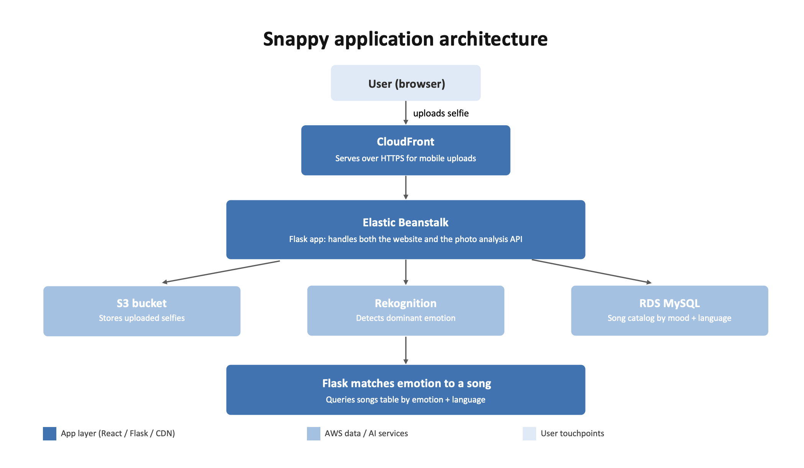

# Snappy 

Snappy is a cloud-based web application that detects a user's emotion from a selfie using AWS Rekognition and recommends a song that matches their mood, in their choice of English, Korean, or Portuguese.

**Note:** The live deployment has been taken down to avoid ongoing AWS costs after the AWS Free Tier period ended. See the demo video below for the application in action.

## Demo

[Add link to your demo video here]

## Architecture



1. User uploads a selfie through the React frontend
2. The frontend converts the image to JPEG client-side (handles iPhone HEIC photos automatically using the browser's own image decoding)
3. Flask receives the image, stores it in **Amazon S3**, and sends it to **AWS Rekognition** for emotion detection
4. Based on the detected emotion and selected language, Flask queries a **MySQL database on Amazon RDS** for a matching song
5. The result — song title, artist, album art, and a listening link — is returned to the user
6. The entire app is deployed on **AWS Elastic Beanstalk**, fronted by **Amazon CloudFront** for HTTPS support

## Tech Stack

**Frontend:** React, Vite
**Backend:** Flask, Python
**AWS Services:** S3, Rekognition, RDS (MySQL), Elastic Beanstalk, CloudFront, IAM, WAF

## Features

- Real-time facial emotion detection (happy, sad, calm, angry, and others mapped to these four core moods)
- Curated song database across three languages (~30+ songs each for English, Korean, and Portuguese)
- Random song selection per emotion so repeated uploads yield varied recommendations
- Client-side image normalization to handle HEIC (iPhone) photos without requiring server-side decoding libraries

## What I Learned

This was my Project 2 for a graduate Cloud Computing course (EN.605.635, Johns Hopkins University). Beyond building the core features, I spent significant time debugging real deployment issues that don't show up until you actually ship something to the cloud:

- **Python version compatibility**: The Elastic Beanstalk Python 3.14 runtime didn't have prebuilt wheels for some pinned package versions, causing builds to fail until I adjusted version constraints in `requirements.txt`.
- **iOS HEIC images**: iPhones default to capturing photos in HEIC format, which AWS Rekognition can't process directly. Rather than adding a server-side HEIC decoding library (which required a system dependency unavailable on Elastic Beanstalk), I solved this client-side by drawing the image onto an HTML `<canvas>` and re-exporting it as JPEG before upload — using the browser's native image decoding instead.
- **CloudFront + WAF**: Diagnosing a 403 error that turned out to be a WAF managed rule blocking large request bodies (i.e., photo uploads).
- **Debugging via Elastic Beanstalk logs**: Working through `eb-engine.log` and `web.stdout.log` to trace deployment failures back to their root cause rather than guessing.

## Project Structure

```
snappy-backend/
├── app.py              # Flask API (Rekognition, S3, RDS integration)
├── requirements.txt
├── Procfile             # gunicorn entrypoint for Elastic Beanstalk
├── schema.sql            # Database schema
└── songs_en_kr.sql, songs_br.sql   # Curated song catalog by language

snappy-frontend/
├── src/
│   ├── App.jsx          # Main UI: upload, language select, results
│   └── App.css
└── index.html
```

## Local Setup

```bash
# Backend
cd snappy-backend
pip install -r requirements.txt
# create a .env file with your own AWS credentials, RDS connection info, and S3 bucket name
python3 app.py

# Frontend (separate terminal, for local dev only)
cd snappy-frontend
npm install
npm run dev
```
